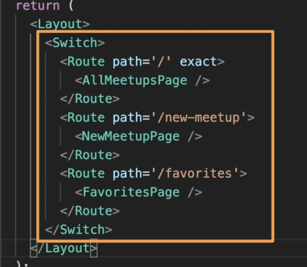
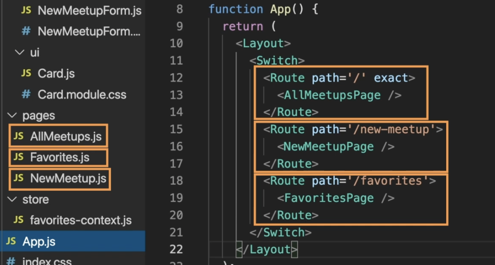

#### What is nextJs?
> 생산용 React 프레임워크

대규모의 양산형 React 앱을 더 편리하게 구축할 수 있도록 많은 기능을 제공합니다.

ReactJS 자체도 이미 프레임워크나 라이브러리아닌가요?
React는 사용자 인터페이스를 구축하기 위한 자바스크립트 라이브러리입니다.

React 가 왜 훌륭한 핵심 라이브러리인 이유는
컴포넌트 , state , props 를 이용해서 사용자 인터페이스 부분에만 초점을 맞추기 떄문입니다.

대규모의 React 프로젝트를 구축하려면 보통 라우팅에 필요한 라이브러리나
인증에 필요한 라이브러리들을 추가해야합니다.

NextJS는 프레임워크, 즉 React 를 기반으로 하는 프레임워크라고 불리는데요
결국 프레임워크와 라이브러리의 차이를 말하자면 프레임워크가 라이브러리 보다 더 크고 기능이 많다는 점이에요

하나에 초점에 맞추기보다는 여러 가지를 다룹니다.
또한 코드를 작성하는 방법이나 파일을 구성하는 방법에 관한 명확한 규칙과 지침이 있습니다.

##### 주요기능1. 내장 서버 측 렌더링 (SEO 향상!)
서버 사이드 렌더링을 내장하고 있다는 것
서버사이드 렌더링이란 페이지 콘텐츠를 클라이언트가 아니라 전적으로 서버에서 준비하는 겁니다.

예를들면
검색 엔진 크롤러는 사실 서버에서 들어온 비어있는 html 만 보게 되는데
이렇게 검색 엔진 크롤러가 이 콘텐츠를 가져오지 못하면 문제가 될수 있습니다.

이럴때 서버 사이드 렌더링이 필요합니다.

서버에서 해당 페이지를 사전 렌더링한 상태에서 서버에서 요청이 들어 왔을 떄
해당 데이터를 서버에서 가져오면 완성된 페이지가 사용자와 검색엔진 크롤러에 제공됩니다.

사용자는 깜빡이는 로딩 상태를 보지 않아도 되고 검색엔진도 해당 페이지 콘텐츠를 볼수있습니다.

사실 ReactJS 에서도 서버 사이드 렌더링을 추가할 수 있는 기능이 내장되어 있지만 제대로 구현하려면 까다롭고 추가 설정이 필요합니다.

NextJS 에서는 훨씬 쉬워집니다.
자도응로 페이지를 사전 렌더링 하는 겁니다.
추가 설정이 필요 하지 않습니다.

#####  주요기능2. 파일 기반 라우팅으로 라우팅 간소화
라우팅이란 사용자에게 여러 페이지가 있는 것처럼 착각하게 하는 것입니다.
서버에 추가로 요청을 보내지 않고 URL 을 기반으로 화면에 보이는 것을 바꿀 수 있어요

React 라우터 버전에 따라 다를 겁니다.

코드에서 페이지로 세 페이지를 설정 했다면 해당 페이지 컴포넌트 폴더에
세개의 페이지 컴포넌트가 있게 됩니다.

NextJS 애플리케이션에는 특수 페이지 폴더가 있습니다.
이름은 pages 여야 합니다. 이 폴더를 구성하고 페이지가 지원하는 라우트와. 경로르 정의하면 됩니다.

#####  주요기능 3. 풀스택 앱 빌드
NextJS 를 이용하면 Next / React 애플리케이션에 쉽체 코드를 추가해서 데이터베이스나 파엘에 데이터를 저장하거나 데이터를 받아오거나, 인증을 추가하기 등

어쨌든 백엔드를 구축할 떄 알아두어야 합니다.
그러면 독립적으로 REST API 프로젝트를 구축하지 않아도 됩니다.
하나의 프로젝트, 즉 Next 프로젝트에 클라이언트 쪽 코드와 React 사용자 인터페이스를 추가하고 백엔드 API 코드와 혼합하면 됩니다.