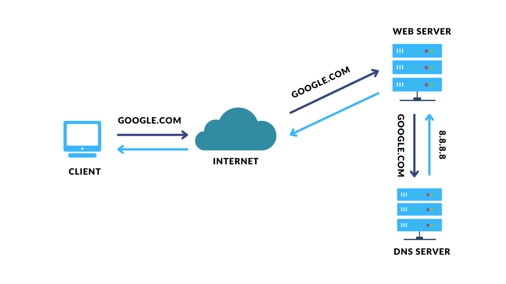
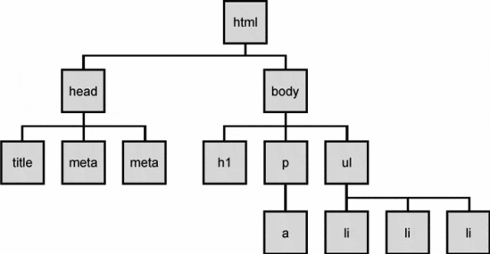
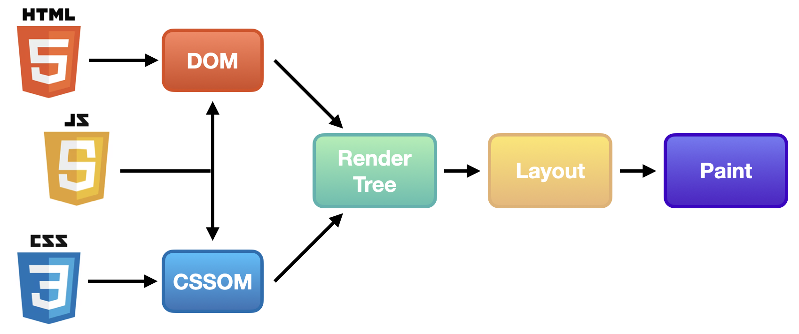

1. google.com 에 IP 를 찾으로 DNS를 찾아간다.

2. 해당 아이플 가지고 해당 서버로 가서 html 리소스를 요청한다(01010101010010101010010010101010...)

3. byte string 을 받음

4. 인코딩을한다
> UTF-8 인코딩을 주로 사용

5. 토큰화 과정을 거침
> '<', 'h', 't', 'm', 'l', '>' 한 자씩 읽어서 토큰으로 생성

6. Nodes
> < body> , < div>, < html> 등

7. DOM Tree
> 노드를 객체화 한 것이 DOM tree (Document Object Model)

8. css 도 똑같은 과정을 거처 CSSOM tree 구축

9. JavaScript 리소스 요청해서 읽어들임 (단, 자바스크립트 해석하는 동안 돔트리 생성을 일시 중지한다.)

10. 렌더트리 생성 <- 레이아웃(렌더트리 배치)

11. 페인트 (color)

12. composite

